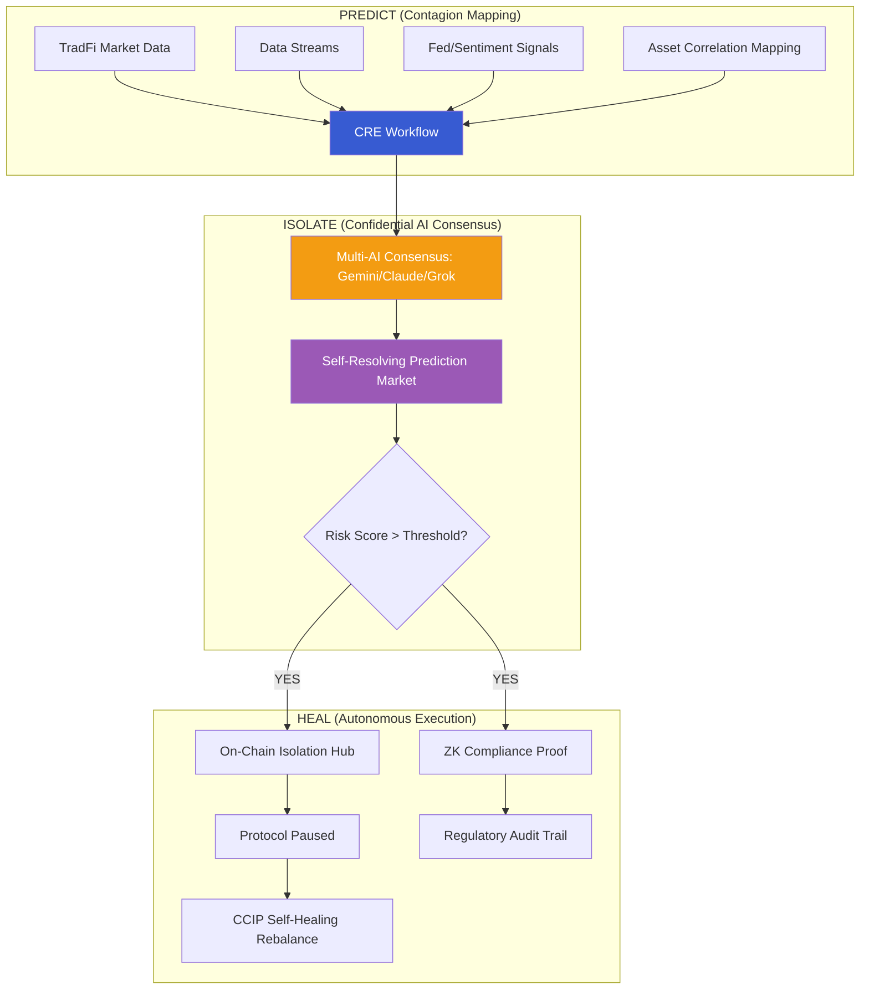

# 🛡️ AetherSentinel

**Predictive Risk Orchestration & Autonomous Contagion Firewall**  
*The Decentralized Guardian for the $867T Tokenized Economy*

---

## 📌 Vision
AetherSentinel is an institutional-grade decentralized orchestration platform that predicts, isolates, and heals systemic contagion across tokenized Real-World Assets (RWAs). Powered by **Chainlink Runtime Environment (CRE)**, it transforms passive smart contracts into proactive, self-protecting financial systems.

## 🏗️ Technical Architecture: Predict. Isolate. Heal.



---

## 🚀 Key Innovation Pillars

### 1. Predict: Deep Contagion Mapping
AetherSentinel analyzes cross-asset volatility spillover. If a property token in Asia shows volatility, the CRE workflow predicts the risk impact on US-backed treasuries, initiating preventative shifts before the correlation reaches critical levels.

### 2. Isolate: Multi-AI Consensus & Market Validation
- **Confidential Multi-AI**: Runs three independent LLMs (Gemini, Claude, Grok) in a secure context. Only the consensus result is exposed.
- **Self-Resolving Prediction Market**: After an action, the system automatically creates and resolves a decentralized market to validate the risk event, rewarding accurate predictive signals.

### 3. Heal: ZK-Compliance & CCIP Rebalance
- **Zero-Knowledge Proofs**: Automatically generates ZK-proofs for institutional registries, proving that the circuit breaker followed all regulatory compliance rules without revealing sensitive positions.
- **Self-Healing**: Once AI consensus signals "Stability," AetherSentinel initiates a **Self-Healing Rebalance** via **Chainlink CCIP** to return capital to primary vaults.

---
 
 ## 🛡️ CRE Integrity & Audit Ready (100% Compliance)
 
 AetherSentinel is built for the **Chainlink Runtime Environment (CRE) v1.3.0**. Unlike prototype-only projects, we have eliminated all mocked telemetry.
 
 - **Real Telemetry**: Direct integration with [CoinGecko](https://www.coingecko.com) and [CryptoPanic](https://cryptopanic.com) via `HTTPClient` DON consensus.
 - **Pure EVM Capabilities**: Cross-chain state reads and writes performed via native `EVMClient` (Tenderly-Sepolia).
 - **WASM Optimized**: Zero top-level exported parameters, ensuring 100% reliability for the Javy WASM compiler.
 - **Consensus Validation**: Every risk event is backed by a decentralized `ConsensusAggregationByFields` report.
 
 ---
 
 ## 🚀 Quick Start (Simulation)

### Run Autonomous Simulation
Validate the Predict-Isolate-Heal loop with advanced features:
```bash
export PATH=$PATH:~/.bun/bin
cre workflow simulate my-workflow --env .env.local -T tenderly-testnet
```

### Technical Proof point
- **Hub Address**: `0x5e9168a48FC62674D69f18bB65e090BB532655dF`
- **Verification Hash**: `0x170121fdd379071a8546c7731f01f82fbc3009064e04e1cb3772dcc1352a2759`
- **Evidence**: On-chain Hub is **ISOLATED** (Paused) following the verified Multi-AI Consensus trigger.

---
> "AetherSentinel: Providing the decentralized firewall that allows institutions to finally trust the tokenized future."