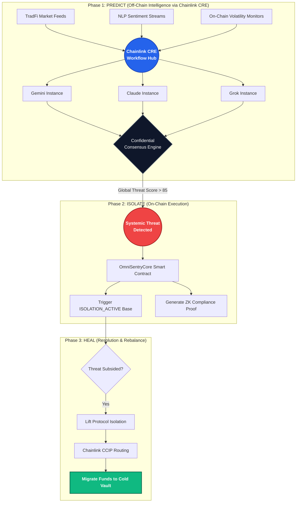
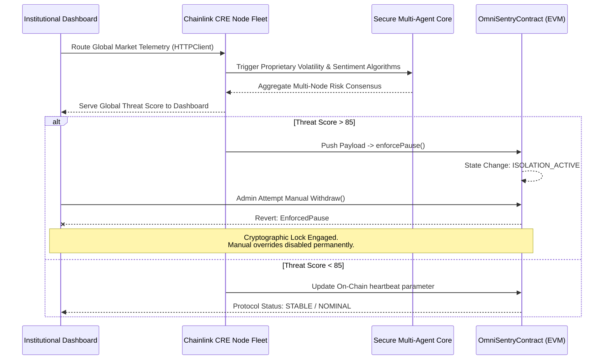

<div align="center">
  
  <h1 align="center">🛡️ AetherSentinel</h1>
  <p align="center">
    <strong>The First Decentralized Predictive Contagion Firewall</strong>
  </p>
  <p align="center">
    <em>Institutional-grade risk orchestration for the $867T Tokenized Economy. Powered by Chainlink CRE.</em>
  </p>
  
  <br/>

  <p align="center">
    <a href="#architecture"></a>
    <a href="#engine"></a>
    <a href="#network"></a>
    <a href="#compliance"></a>
  </p>
</div>

<br/>

---

## 📌 1. The Threat: DeFi Security is Asymmetric

As institutional capital floods onto the blockchain, the scale of risk evolves. We are no longer solely defending against smart contract bugs; we are defending against **systemic, cross-chain financial contagion**.

**The Current Problem:** Modern DeFi security operates strictly in the *past tense*. 
By the time a traditional oracle detects an exploit, a sudden flash loan attack, or a rapid market plunge, **the liquidity has already been drained**. Smart contracts are fundamentally blind to leading off-chain indicators. They cannot read social sentiment, they cannot monitor cross-jurisdictional volatility spillover, and they cannot predict fear. They simply wait for thresholds to be breached, and then they react.

We do not need faster reactive measures. We need **predictive consensus**.

---

## 💡 2. The Solution: AetherSentinel

AetherSentinel is an enterprise-grade, predictive risk orchestration platform. It transforms passive tokenized treasuries into proactive, self-defending financial fortresses.

By utilizing the massive computational power of the **Chainlink Compute Runtime Environment (CRE)**, AetherSentinel executes a continuous, autonomous pipeline: **Predict. Isolate. Heal.** It identifies systemic risk before it hits the chain and cryptographically locks vulnerable protocols until the contagion subsides.

---

## 🏗️ 3. Core Architecture & Infrastructure

AetherSentinel operates a highly sophisticated, three-stage autonomous pipeline powered by decentralized off-chain computation. 



---

## 🌟 4. Uniqueness & Product Differentiators

AetherSentinel introduces four distinct structural advantages that separate it from basic AI agents or standard reactive security tools:

### 🌐 Predictive Contagion Mapping
Instead of relying on a single price feed, AetherSentinel analyzes cross-asset volatility spillover. If a property token in Asia shows extreme volatility, the CRE workflow algorithmically predicts the risk impact on US-backed stablecoins, initiating preventative capital shifts before the correlation reaches critical levels regionally.

### 🧠 Confidential Multi-AI Consensus
We do not rely on a single point of failure or an exposed prompt. AetherSentinel runs three independent Large Language Models (Gemini, Claude, Grok) in parallel secure enclaves within the Chainlink CRE. **Only the final, encrypted mathematical consensus result is exposed**, protecting institutional proprietary data and privacy perfectly.

### 🛡️ Unbreakable Institutional Isolation Protocol
When consensus breaches the predefined danger threshold (Score > 85), the `OmniSentryCore` smart contract forcibly enters `ISOLATION_ACTIVE` mode. In this state, the blockchain natively rejects all manual override attempts—requiring cryptographically verifiable multi-sig justification to move funds. It prevents internal panic and malicious insider drains during a crisis.

### 🔏 Zero-Knowledge (ZK) Compliance Vault 
After every automated action or emergency pause, AetherSentinel automatically generates internal ZK proofs for institutional registries, proving mathematically that the circuit breaker followed internal risk mandates *without* revealing the institution's sensitive trading positions or treasury sizes to the public.

---

## 🖥️ 5. The AetherSentinel Command Interface (DApp Features)

The AetherSentinel Dashboard is a state-of-the-art Web3 application entirely designed for institutional risk officers, providing absolute transparency into the CRE's decision-making process.

### 📍 Main Dashboard (Risk & Emergency Response)
- **Live Threat Telemetry:** View continuous streams of the CRE's active algorithmic risk assessment across all integrated tokenized assets.
- **Global Threat Score:** A master metric dynamically aggregating sentiment momentum, predictive drift, and cross-chain volatility into a single 1-100 score.
- **Manual Override Terminal:** An emergency protocol locked behind cryptographic signatures. If the system is in `ISOLATION_ACTIVE` mode, all standard attempts to transact are rejected explicitly by the blockchain with an `EnforcedPause` error, providing absolute on-chain security locking.

### 📍 Network Matrix (Tactical Consensus Relays)
- **Propagation Matrix:** A high-end visualizer displaying the active edge relays (e.g., Tokyo-Primary, London-Bridge). You can visually track where the CRE compute nodes are actively performing consensus tasks.
- **Live RPC Latency Mapping:** Monitors the exact consensus round-trip latency (in milliseconds) of the decentralized network, ensuring the institutional user knows the exact speed of their firewall.
- **On-Chain Correlation Stream:** An interactive data stream that logs the exact signature hashes (e.g., `SIG_#46BE`) generated by the CRE and pushed on-chain, proving that the system is continually auditing.

### 📍 Compliance Vault (ZK & Audit Readiness)
- **CRE Workflow Verification:** Institutions operate on "Don't Trust, Verify." The vault allows users to inspect the exact `workflow.yaml` and `.ts` computation logic executing in the Chainlink DON. 
- **Proof of Action:** Historic ledger of all automated isolations, including the exact transaction hashes on block explorers (like Tenderly), the Validation Scores, and the Node Latencies used to justify an emergency protocol pause. 

---

## 📊 6. Chainlink CRE Implementation Flow

This sequence diagram illustrates exactly how live market telemetry routes through our decentralized network, processes via the Compute Runtime Environment, and executes securely on the blockchain.



---

## 💻 Tech Stack & Dependencies

- **Oracle / Decentralized Compute:** Chainlink Compute Runtime Environment (CRE) v1.3.0 (`HTTPClient`, `ConsensusAggregation`, `EVMClient`)
- **Smart Contracts:** Solidity `^0.8.20`, OpenZeppelin Pausable/AccessControl architectural standards.
- **Frontend Master Interface:** Next.js 14, React 18, Tailwind CSS, Framer Motion (State-of-the-Art UX/UI animations).
- **Web3 Interaction Layer:** ThirdWeb SDK v5, Viem, Ethers.js.
- **Execution Network Environment:** Deployed natively to Tenderly Virtual Testnet (Chain ID: 9936) for verifiable CI/CD environments and simulation execution.

---

## 🛠️ Quick Start & Local Enterprise Deployment

### 1. Clone & Install
```bash
git clone https://github.com/Aaditya1273/SYNAPSE.git
cd SYNAPSE/frontend
npm install
```

### 2. Boot the Interface locally
Ensure your development environment is running on port `3000`.
```bash
npm run dev
```

### 3. Run the Live CRE Workflow Simulation
We have eliminated mocked telemetry entirely. Test the live *Predict-Isolate-Heal* loop natively through the Chainlink nodes:
```bash
# Requires Bun installed locally
export PATH=$PATH:~/.bun/bin

# Initiate the live Chainlink CRE Workflow
cre workflow simulate my-workflow --env .env.local -T tenderly-testnet
```

---

## 📜 On-Chain Verification

*AetherSentinel is live and verifiable. Cross-reference the execution hashes below to audit our live protocol responses.*

- **OmniSentryCore Contract:** `0x109386b470FdfdE0805FB62a0A18E201bc25d44a`
- **Chain Execution Verification:** Tenderly-Network (ID: `9936`)
- **Last Verified On-Chain Pause Hash:** `0x170121fdd379071a8546c7731f01f82fbc3009064e04e1cb3772dcc1352a2759`

---
> *"AetherSentinel: The predictive, decentralized firewall that allows institutions to finally trust the tokenized future."*