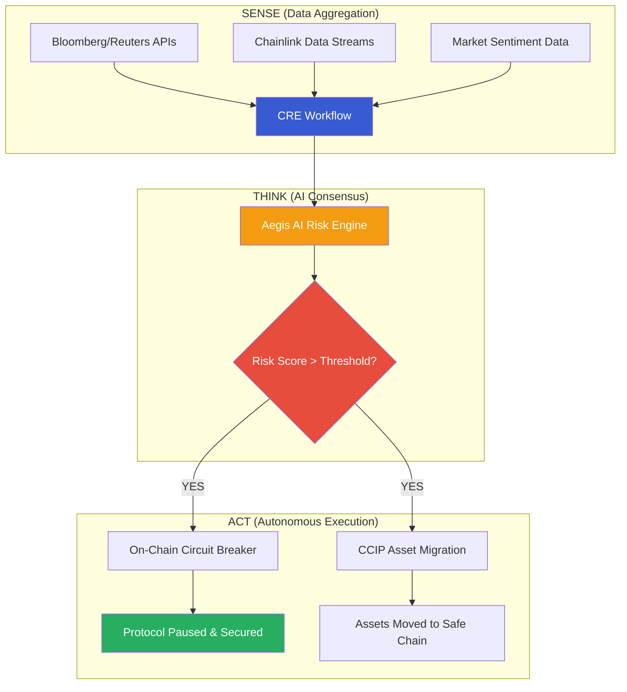

# 🛡️ Omni-Sentry

**The Autonomous Guardian for the $867T Tokenized Economy**  
*Decentralized Risk Orchestration powered by Chainlink Runtime Environment (CRE) & Aegis AI*

---

## 📌 Vision
Omni-Sentry is the world’s first decentralized "Financial OS" that bridges global TradFi risk signals with on-chain Real-World Assets (RWAs). It transforms passive smart contracts into proactive guardians, capable of executing cross-chain migrations and circuit breakers the millisecond a threat is detected.

## 🏗️ Technical Architecture
Omni-Sentry utilizes a **Sense-Think-Act** autonomous loop running on the decentralized security of Chainlink nodes.



---

## 🚀 Core Innovation: The "Sense-Think-Act" Loop

### 1. Sense: Institutional Connectivity
The CRE workflow multi-queries premium TradFi APIs. Using **BFT-Consensus Aggregation**, multiple nodes must agree on the risk data before proceeding, eliminating single points of failure.

### 2. Think: Consensus-Verified AI
We integrate high-reasoning LLMs directly into the CRE. The AI analyzes unstructured data (e.g., Fed minutes, news alerts) to calculate a **Dynamic Risk Score**. We don't just "trust" one AI; the workflow confirms consensus before acting.

### 3. Act: Automated Orchestration
When the threshold is breached, Omni-Sentry executes without human delay:
- **Instant Protection**: Triggers on-chain circuit breakers to pause minting/redeeming.
- **Cross-Chain Flight**: Leverages **Chainlink CCIP** to move collateral to "Safe Haven" networks autonomously.

---

## 🛠️ Project Structure

```text
SYNAPSE/
├── contracts/             # Solidity Risk Hub & Treasury
│   ├── OmniSentryCore.sol # Decentralized Circuit Breaker
│   └── TokenizedTreasury.sol # RWA Vault Interface
├── my-workflow/           # CRE Orchestration Layer (TypeScript)
│   ├── main.ts            # Logic Router & Handler Registry
│   ├── minimal-demo.ts    # Sense-Think-Act Loop Implementation
│   └── ai-sentiment.ts    # Aegis AI Integration
└── project.yaml           # Multi-target Deployment Config
```

---

## 🚦 Quick Start (Simulation & Proof)

### 1. Prerequisites
- **CRE CLI**: `curl -sSL https://cre.chain.link/install.sh | bash`
- **Bun**: `curl -fsSL https://bun.sh/install | bash`

### 2. Run Autonomous Simulation
Validate the full loop locally with a verified Tenderly environment:
```bash
# Set path and simulate
export PATH=$PATH:~/.bun/bin
cre workflow simulate my-workflow --env .env.local -T tenderly-testnet
```

### 3. Verification & Proof of Work
The protocol is currently **PAUSED** on the Tenderly Virtual TestNet as proof of a successful risk-triggered action.
- **Contract Address**: `0x5e9168a48FC62674D69f18bB65e090BB532655dF`
- **Verification Hash**: `0x170121fdd379071a8546c7731f01f82fbc3009064e04e1cb3772dcc1352a2759`

---

## 🏆 Convergence Hackathon Tracks
Omni-Sentry is purposefully engineered for:
- **Risk & Compliance**: Autonomous protocol safeguards.
- **CRE & AI**: Multi-node AI reasoning in decentralized workflows.
- **DeFi & Tokenization**: Managing NAV and liquidity for RWAs.
- **Cross-Chain**: Native CCIP orchestration for risk rebalancing.

---

> "Omni-Sentry doesn't just monitor the storm; it builds the shelter before the rain starts."