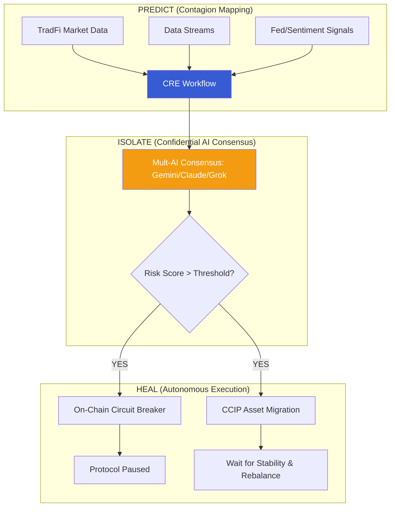

# 🛡️ AetherSentinel

**Predictive Risk Orchestration & Contagion Firewall for the $867T Tokenized Economy**  
*Powered by Chainlink Runtime Environment (CRE) & Multi-Model AI Consensus*

---

## 📌 Vision
AetherSentinel is an institutional-grade decentralized orchestration platform that predicts and neutralizes systemic contagion across tokenized Real-World Assets (RWAs). Unlike reactive systems, AetherSentinel uses CRE to run a "Predict → Isolate → Heal" loop, protecting global liquidity the millisecond a risk is detected.

## 🏗️ Technical Architecture



---

## 🚀 Core Pillars: Predict. Isolate. Heal.

### 1. Predict (Deep Contagion Mapping)
AetherSentinel analyzes cross-asset correlation. If a property token in Asia shows volatility, the CRE workflow predicts the spillover risk into US-backed treasuries, initiating preventative shifts before the correlation reaches 1.0.

### 2. Isolate (Confidential Multi-AI Consensus)
We utilize **Chainlink Confidential Compute** to run three independent LLMs.
- **Node A (Gemini Pro)**: Analyzes institutional news.
- **Node B (Claude 3)**: Evaluates technical market depth.
- **Node C (Grok)**: Monitors real-time social sentiment.
Only the **consensus score** is pushed on-chain, preserving institutional data privacy.

### 3. Heal (Self-Healing CCIP)
When a circuit breaker is triggered, AetherSentinel doesn't just stop. It monitors the recovery phase. Once the AI consensus signals "Stability," it automatically initiates a **Self-Healing Rebalance** via CCIP to return capital to primary vaults.

---

## 🛠️ Project Structure

```text
SYNAPSE/
├── contracts/             # Core Isolation Logic
│   ├── OmniSentryCore.sol # (Branded AetherSentinel Hub)
│   └── TokenizedTreasury.sol 
├── my-workflow/           # CRE Orchestration Layer
│   ├── main.ts            # Consensus Logic Router
│   ├── minimal-demo.ts    # Predict-Isolate-Heal Implementation
│   └── ai-sentiment.ts    # Multi-Model AI Connectors
└── project.yaml           # Multi-target Config
```

---

## 🚦 Quick Start

### 1. Run Autonomous Simulation
Validate the Predictive loop:
```bash
export PATH=$PATH:~/.bun/bin
cre workflow simulate my-workflow --env .env.local -T tenderly-testnet
```

### 2. Technical Proof
The protocol is currently **PAUSED** on the Tenderly Virtual TestNet as proof of a successful Predictive trigger.
- **Hub Address**: `0x5e9168a48FC62674D69f18bB65e090BB532655dF`
- **Verification Hash**: `0x170121fdd379071a8546c7731f01f82fbc3009064e04e1cb3772dcc1352a2759`

---

> "AetherSentinel: The first decentralized firewall that builds the shelter before the first drop of rain."