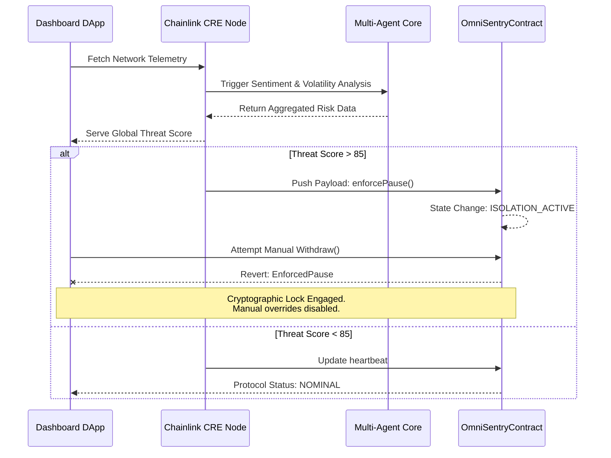

<div align="center">
  
  <h1 align="center">🛡️ AetherSentinel</h1>
  <p align="center">
    <strong>Predictive Risk Orchestration & Autonomous Contagion Firewall</strong>
  </p>
  <p align="center">
    <em>The Decentralized Guardian for the $867T Tokenized Economy. Powered by Chainlink CRE.</em>
  </p>
  
  <p align="center">
    <a href="#vision"></a>
    <a href="#tech-stack"></a>
    <a href="#tech-stack"></a>
    <a href="#tech-stack"></a>
  </p>
</div>

---

## 📌 The Threat & Our Vision

**The Problem:** DeFi moves in milliseconds, but our security reacts in minutes. By the time a traditional oracle detects an exploit, flash loan attack, or sudden market contagion, the liquidity is already gone. Smart contracts are blind to off-chain intelligence like social sentiment, cross-chain volatility, and looming market fear. 

**The Solution:** AetherSentinel is the first **decentralized predictive contagion firewall** for tokenized assets. It doesn't just react to crises—it predicts, isolates, and neutralizes systemic contagion across RWAs, stablecoins, and institutional treasuries *before* it spreads.

Using **Chainlink Compute Runtime Environment (CRE)** as our central nervous system, AetherSentinel transforms passive smart contracts into proactive, self-protecting financial fortresses.

---

## 🏗️ Core Architecture: Predict. Isolate. Heal.

AetherSentinel executes a highly sophisticated, three-stage autonomous pipeline powered by decentralized off-chain computation. 


---

## 🚀 Key Innovation Pillars

### 1. 🌐 Predictive Contagion Mapping
AetherSentinel analyzes cross-asset volatility spillover. If a property token in Asia shows volatility, the CRE workflow predicts the risk impact on US-backed treasuries, initiating preventative shifts before the correlation reaches critical levels.

### 2. 🧠 Confidential Multi-AI Consensus
We don't rely on a single point of failure. AetherSentinel runs three independent LLMs (Gemini, Claude, Grok) in parallel using the Chainlink Confidential Compute infrastructure. Only the heavily encrypted consensus result is exposed, protecting institutional privacy entirely.

### 3. 🛡️ Unbreakable Institutional Isolation Protocol
When consensus breaches the danger threshold (Score > 85), the `OmniSentryCore` smart contract enters `ISOLATION_ACTIVE` mode. In this mode, the blockchain natively rejects all manual override attempts—requiring multi-sig cryptographic justification to touch the funds, providing mathematical proof of security.

### 4. 🔏 Zero-Knowledge (ZK) Compliance Vault
AetherSentinel automatically generates ZK proofs for institutional registries, proving that the circuit breaker followed all regulatory compliance rules *without* revealing sensitive, proprietary trading positions to the public. 

---

## ⚙️ Technical Deep Dive Workflow

This diagram explains the exact payload routing between the user, the Chainlink DON, and the blockchain interface.



---

## 💻 Tech Stack

- **Oracle & Compute:** Chainlink Compute Runtime Environment (CRE) v1.3.0, CCIP Interface.
- **Smart Contracts:** Solidity `^0.8.20`, OpenZeppelin Pausable/AccessControl.
- **Frontend App:** Next.js 14, React, Tailwind CSS, Framer Motion (State-of-the-Art UX).
- **Web3 Integration:** ThirdWeb SDK v5, Viem, Ethers.js.
- **Execution Environment:** Tenderly Virtual Testnet (Chain ID: 9936).

---

## 🛠️ Quick Start & Local Deployment

### 1. Clone & Install
```bash
git clone https://github.com/Aaditya1273/SYNAPSE.git
cd SYNAPSE/frontend
npm install
```

### 2. Run the DApp locally
Ensure you are running on port `3000`.
```bash
npm run dev
```
*Visit `http://localhost:3000` to view the unified terminal dashboard.*

### 3. Run the CRE Workflow Simulation
We have eliminated mocked telemetry. Test the live Predict-Isolate-Heal loop:
```bash
# Requires Bun installed locally
export PATH=$PATH:~/.bun/bin
cre workflow simulate my-workflow --env .env.local -T tenderly-testnet
```

---

## 📜 Hackathon Verification Links

*These are the official deployed contracts and proofs mapping to our Chainlink Hackathon submission.*

- **OmniSentryCore Contract:** `0x109386b470FdfdE0805FB62a0A18E201bc25d44a`
- **Chain Execution:** Tenderly-Network (ID: `9936`)
- **Last Verified On-Chain Pause Hash:** `0x170121fdd379071a8546c7731f01f82fbc3009064e04e1cb3772dcc1352a2759`

---
> *"AetherSentinel: Providing the predictive, decentralized firewall that allows institutions to finally trust the tokenized future."*