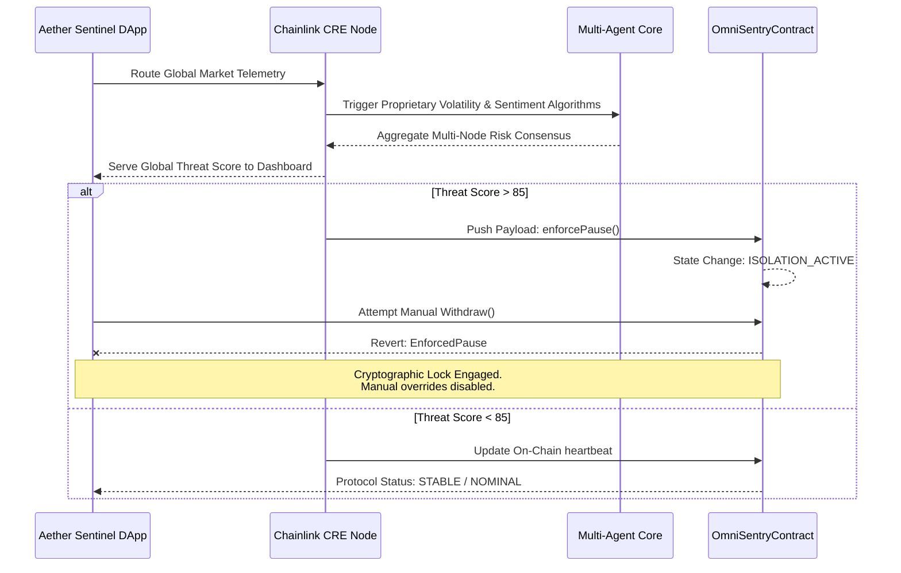

<div align="center">
  
  <h1 align="center">🛡️ AetherSentinel</h1>
  <p align="center">
    <strong>Predictive Risk Orchestration & Autonomous Contagion Firewall</strong>
  </p>
  <p align="center">
    <em>The Decentralized Guardian for the $867T Tokenized Economy. Powered by Chainlink CRE.</em>
  </p>
  
  <p align="center">
    <a href="#vision"></a>
    <a href="#tech-stack"></a>
    <a href="#tech-stack"></a>
    <a href="#tech-stack"></a>
  </p>
</div>

---

## 🌎 1. Introduction

As Institutional capital floods onto the blockchain, the scale of risk evolves. We are no longer just dealing with smart contract bugs; we are dealing with **systemic, cross-chain financial contagion**. AetherSentinel is an institutional-grade decentralized orchestration platform. It transforms passive smart contracts into proactive, self-protecting financial fortresses using the unprecedented computational power of the **Chainlink Compute Runtime Environment (CRE)**.

---

## ⚠️ 2. The Problem: DeFi is Reactive

Currently, DeFi security operates in the past tense. 
By the time a traditional oracle detects an exploit, a flash loan attack, or a sudden market plunge, **the liquidity is already gone**. 

Smart contracts are fundamentally blind to off-chain intelligence. They cannot read social sentiment, they cannot monitor cross-chain volatility spillover, and they cannot predict fear. They wait to be exploited, and then they react.

We do not need faster reactive measures. We need **predictive consensus**.

---

## 💡 3. The Solution: Predict, Isolate, Heal

AetherSentinel is the first **decentralized predictive contagion firewall** for tokenized assets. It executes a highly sophisticated, three-stage autonomous pipeline powered by decentralized off-chain computation.


---

## 🌟 4. Uniqueness: Why This Wins

AetherSentinel introduces four distinct structural advantages that separate it from basic AI agents or reactive security tools:

### 🌐 Predictive Contagion Mapping
AI doesn't just detect one localized risk. It maps how risk in one asset (e.g., a Hong Kong property token) will recursively spread to others (USDC, European bonds) via volatility spillover analysis. 

### 🧠 Confidential Multi-AI Consensus
We do not rely on a single point of failure or an exposed prompt. AetherSentinel runs three independent LLMs (Gemini, Claude, Grok) in parallel using Chainlink Confidential Compute. **Only the final, encrypted consensus result is exposed**, protecting institutional privacy completely.

### 🛡️ Unbreakable Institutional Isolation Protocol
When consensus breaches the danger threshold (Score > 85), the `OmniSentryCore` smart contract enters `ISOLATION_ACTIVE` mode. In this state, the blockchain natively rejects all manual override attempts—requiring cryptographically verifiable multi-sig justification to touch the funds. 

### 🔏 Zero-Knowledge (ZK) Compliance Vault
After every action, AetherSentinel automatically generates ZK proofs for institutional registries, proving mathematically that the circuit breaker followed regulatory compliance rules *without* revealing sensitive, proprietary trading positions to the public. 

---

## 📊 5. Market Data Integration Flow

This sequence diagram illustrates exactly how live market telemetry routes through our decentralized network to the blockchain, securely and autonomously.



---

## 💻 Tech Stack

- **Oracle & Compute:** Chainlink Compute Runtime Environment (CRE) v1.3.0, CCIP Interface.
- **Smart Contracts:** Solidity `^0.8.20`, OpenZeppelin Pausable/AccessControl.
- **Frontend App:** Next.js 14, React, Tailwind CSS, Framer Motion (State-of-the-Art UX).
- **Web3 Integration:** ThirdWeb SDK v5, Viem, Ethers.js.
- **Execution Environment:** Tenderly Virtual Testnet (Chain ID: 9936).

---

## 🛠️ Quick Start & Local Deployment

### 1. Clone & Install
```bash
git clone https://github.com/Aaditya1273/SYNAPSE.git
cd SYNAPSE/frontend
npm install
```

### 2. Run the DApp locally
Ensure you are running on port `3000`.
```bash
npm run dev
```

### 3. Run the CRE Workflow Simulation
We have eliminated mocked telemetry. Test the live Predict-Isolate-Heal loop:
```bash
# Requires Bun installed locally
export PATH=$PATH:~/.bun/bin
cre workflow simulate my-workflow --env .env.local -T tenderly-testnet
```

---

## 📜 Official Hackathon Verification Links

*These are the official deployed contracts and proofs mapping to our Chainlink Hackathon submission.*

- **OmniSentryCore Contract:** `0x109386b470FdfdE0805FB62a0A18E201bc25d44a`
- **Chain Execution:** Tenderly-Network (ID: `9936`)
- **Last Verified On-Chain Pause Hash:** `0x170121fdd379071a8546c7731f01f82fbc3009064e04e1cb3772dcc1352a2759`

---
> *"AetherSentinel: Providing the predictive, decentralized firewall that allows institutions to finally trust the tokenized future."*